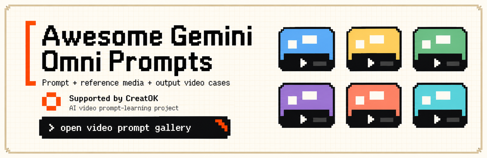

# Awesome Gemini Omni Prompts [](https://awesome.re)

<div align="center">

<a href="https://www.creatok.ai/zh?utm_source=github&utm_medium=readme_hero&utm_campaign=awesome-gemini-omni-prompts">
  
</a>

[](LICENSE)
[](#contents)
[](https://yuanxingniao.github.io/gemini-omni-prompt-gallery/?utm_source=github&utm_medium=badge&utm_campaign=awesome-gemini-omni-prompts)
[](https://www.creatok.ai/zh?utm_source=github&utm_medium=readme_badge&utm_campaign=awesome-gemini-omni-prompts)
[](README_zh-CN.md)

</div>

## Contents

- [Introduction](#introduction)
- [What is Gemini Omni](#what-is-gemini-omni)
- [News](#news)
- [Use Gemini Omni Prompts](#use-gemini-omni-prompts)
- [Text-to-Video Generation Cases](#-text-to-video-generation-cases)
- [Video Editing / V2V Cases](#️-video-editing--v2v-cases)
- [How to Contribute](#how-to-contribute)
- [Acknowledge](#acknowledge)
- [Star History](#star-history)

## Introduction

A curated collection of **30 Gemini Omni prompt + video examples** gathered from public X posts and manually reviewed for prompt/video pairing quality.

This repository is designed as a lightweight prompt library and discovery surface. The full interactive video gallery is hosted separately:

<a href="https://yuanxingniao.github.io/gemini-omni-prompt-gallery/?utm_source=github&utm_medium=readme&utm_campaign=awesome-gemini-omni-prompts"></a>
<a href="https://www.creatok.ai/zh?utm_source=github&utm_medium=readme_intro&utm_campaign=awesome-gemini-omni-prompts"></a>

## What is Gemini Omni

Gemini Omni is a multimodal video generation and editing workflow around Google's Gemini/Flow ecosystem. These examples focus on reusable prompts, reference media workflows, and output videos that show what the prompt actually produced.

## News

**May 21, 2026:** Initialized repository with 30 curated Gemini Omni video prompt cases (21 text-to-video, 9 video-editing/V2V).

## Use Gemini Omni Prompts

1. Browse a case below or open the full gallery.
2. Copy the complete prompt.
3. If the case uses reference media, open the source/gallery detail to inspect the reference/output pairing.
4. Recreate or adapt it in Gemini Omni / Flow.

## 🎬 Text-to-Video Generation Cases

> **21 curated cases**

<!-- Case 1: Mechanical Baby Octopus (by @andrewolinek) -->
### Case 1: [Mechanical Baby Octopus](https://x.com/andrewolinek/status/2057003482012402018) (by [@andrewolinek](https://x.com/andrewolinek))

| Output | Category |
| :----: | :------- |
| <a href="https://yuanxingniao.github.io/gemini-omni-prompt-gallery/?utm_source=github&utm_medium=picture&utm_campaign=awesome-gemini-omni-prompts#case-0001" target="_blank" rel="noopener noreferrer"></a> | **Text-to-Video Generation**<br>Macro fantasy creature animation<br>[Open full video case](https://yuanxingniao.github.io/gemini-omni-prompt-gallery/?utm_source=github&utm_medium=case-link&utm_campaign=awesome-gemini-omni-prompts#case-0001) |

**Prompt:**

```text
"image_profile": {     "source_style": "professional macro fantasy photography",     "overall_aesthetic": "hyper-photorealistic, ultra-detailed, whimsical and bioluminescent underwater style, National Geographic-level texture fidelity",     "mood": "mysterious, playful, and magical",     "subject": {       "main_subject": "mechanical baby octopus creature",       "description": "A small, wide-eyed marine entity blending organic flesh with ornate clockwork elements. It features large, glassy, luminous black eyes with starry glints and a small smiling mouth.",       "clothing_details": "not applicable",       "facial_features": "Oversized, expressive, highly reflective dark eyes bordered by intricate golden metallic rims, set into a bulbous, textured head covered in small rivets and filigree.",       "pose_and_action": "Centrally positioned, looking forward towards the camera with curling, gold-adorned tentacles spreading downward.",       "texture_details": "Polished brass and gold metallic components, translucent pearlescent skin, raised sensory bumps, and micro-engraved metallic gears seamlessly embedded into the skin."    },     "environment": {       "setting": "deep ocean or mystical aquatic biome",       "background_elements": "Another similar creature blurred in the background, surrounded by floating organic debris, bubbles, and soft sea flora.",       "atmosphere": "Deep underwater marine setting filled with suspended particles and floating light orbs, creating a dreamlike, subaquatic bokeh effect.",       "color_palette": "Deep teals and blues contrasted heavily with warm golden, amber, and orange bioluminescent glows."    },     "lighting": {       "primary_light": "Internal bioluminescent amber glow radiating from within the creature's head and tentacles",       "secondary_light": "Soft blue ambient underwater light highlighting the upper curves of the body",       "shadows": "Smooth, gentle drop shadows accentuating the depth of the tentacles and metallic details",       "mood_lighting": "Magical, high-contrast glow with dramatic golden rim lighting against a dark cool background"    },     "composition": {       "framing": "vertical close-up portrait",       "focal_point": "The sharp, highly reflective left eye and the intricate gold detailing on the head",       "depth": "Extremely shallow depth of field, creating a buttery, circular bokeh out of background lights",       "perspective": "Eye-level, intimate close-up perspective",       "negative_space": "Dark, desaturated teal and blue background framing the bright, warm subject"    },     "camera_and_technical": {       "camera": "Sony A7R V",       "lens": "90mm f/2.8 Macro lens",       "settings": "ISO 400, f/3.2, 1/160s",       "film_stock": "CineStill 800T emulation for dramatic tungsten and ambient glow",       "post_processing": "Enhanced micro-contrast, vibrant golden-hour color grading on the subject, crisp sharpness retention on metallic textures"    },     "quality_level": "museum-grade photorealism, maximum texture fidelity, zero AI artifacts, National Geographic / magazine cover quality, 8K resolution"  }
```

**Source:** [https://x.com/andrewolinek/status/2057003482012402018](https://x.com/andrewolinek/status/2057003482012402018)

<!-- Case 2: Butter Crust Ideas (by @pigeon__s) -->
### Case 2: [Butter Crust Ideas](https://x.com/pigeon__s/status/2056921117445521524) (by [@pigeon__s](https://x.com/pigeon__s))

| Output | Category |
| :----: | :------- |
| <a href="https://yuanxingniao.github.io/gemini-omni-prompt-gallery/?utm_source=github&utm_medium=picture&utm_campaign=awesome-gemini-omni-prompts#case-0002" target="_blank" rel="noopener noreferrer"></a> | **Text-to-Video Generation**<br>Recipe explainer from leftovers<br>[Open full video case](https://yuanxingniao.github.io/gemini-omni-prompt-gallery/?utm_source=github&utm_medium=case-link&utm_campaign=awesome-gemini-omni-prompts#case-0002) |

**Prompt:**

```text
generate a video of what i can do with leftover homemade butter pie crust besides making a pie obviously and include ingredients
```

**Source:** [https://x.com/pigeon__s/status/2056921117445521524](https://x.com/pigeon__s/status/2056921117445521524)

<!-- Case 3: Exploring Mars Trailer (by @sajalrajhans1) -->
### Case 3: [Exploring Mars Trailer](https://x.com/sajalrajhans1/status/2056790440943419395) (by [@sajalrajhans1](https://x.com/sajalrajhans1))

| Output | Category |
| :----: | :------- |
| <a href="https://yuanxingniao.github.io/gemini-omni-prompt-gallery/?utm_source=github&utm_medium=picture&utm_campaign=awesome-gemini-omni-prompts#case-0003" target="_blank" rel="noopener noreferrer"></a> | **Text-to-Video Generation**<br>10-second sci-fi teaser<br>[Open full video case](https://yuanxingniao.github.io/gemini-omni-prompt-gallery/?utm_source=github&utm_medium=case-link&utm_campaign=awesome-gemini-omni-prompts#case-0003) |

**Prompt:**

```text
Generate a 10-second cinematic teaser trailer for a movie titled “Exploring Mars.”
```

**Source:** [https://x.com/sajalrajhans1/status/2056790440943419395](https://x.com/sajalrajhans1/status/2056790440943419395)

<!-- Case 5: Glass Lion Morph (by @raza8542121) -->
### Case 5: [Glass Lion Morph](https://x.com/raza8542121/status/2056807415421751372) (by [@raza8542121](https://x.com/raza8542121))

| Output | Category |
| :----: | :------- |
| <a href="https://yuanxingniao.github.io/gemini-omni-prompt-gallery/?utm_source=github&utm_medium=picture&utm_campaign=awesome-gemini-omni-prompts#case-0005" target="_blank" rel="noopener noreferrer"></a> | **Text-to-Video Generation**<br>Sculpture melts into clockwork<br>[Open full video case](https://yuanxingniao.github.io/gemini-omni-prompt-gallery/?utm_source=github&utm_medium=case-link&utm_campaign=awesome-gemini-omni-prompts#case-0005) |

**Prompt:**

```text
A cinematic macro shot of a sleek, glass sculpture of a lion standing on a wooden table. The glass gradually melts into a flowing, golden liquid, which then reorganizes itself into a complex, intricate mechanical clockwork lion, all in one continuous, fluid 10-second motion.
```

**Source:** [https://x.com/raza8542121/status/2056807415421751372](https://x.com/raza8542121/status/2056807415421751372)

<!-- Case 6: V8 Engine Explainer (by @yasinaktimur) -->
### Case 6: [V8 Engine Explainer](https://x.com/yasinaktimur/status/2056826860508463448) (by [@yasinaktimur](https://x.com/yasinaktimur))

| Output | Category |
| :----: | :------- |
| <a href="https://yuanxingniao.github.io/gemini-omni-prompt-gallery/?utm_source=github&utm_medium=picture&utm_campaign=awesome-gemini-omni-prompts#case-0006" target="_blank" rel="noopener noreferrer"></a> | **Text-to-Video Generation**<br>Mechanics explained on video<br>[Open full video case](https://yuanxingniao.github.io/gemini-omni-prompt-gallery/?utm_source=github&utm_medium=case-link&utm_campaign=awesome-gemini-omni-prompts#case-0006) |

**Prompt:**

```text
8 pistonlu motorların nasıl çalıştığını açıklayan adam.
```

**Source:** [https://x.com/yasinaktimur/status/2056826860508463448](https://x.com/yasinaktimur/status/2056826860508463448)

<!-- Case 8: Physics Evolution (by @raza8542121) -->
### Case 8: [Physics Evolution](https://x.com/raza8542121/status/2056805328382316995) (by [@raza8542121](https://x.com/raza8542121))

| Output | Category |
| :----: | :------- |
| <a href="https://yuanxingniao.github.io/gemini-omni-prompt-gallery/?utm_source=github&utm_medium=picture&utm_campaign=awesome-gemini-omni-prompts#case-0008" target="_blank" rel="noopener noreferrer"></a> | **Text-to-Video Generation**<br>Solar system to neural network<br>[Open full video case](https://yuanxingniao.github.io/gemini-omni-prompt-gallery/?utm_source=github&utm_medium=case-link&utm_campaign=awesome-gemini-omni-prompts#case-0008) |

**Prompt:**

```text
A cinematic 10-second sequence showcasing the evolution of a physical concept: start with a detailed 3D claymation model of a solar system, then seamlessly transform it into a fluid, hyper-realistic water simulation flowing into the shape of a neural network, demonstrating advanced multi-modal world modeling and physics-based fluid dynamics
```

**Source:** [https://x.com/raza8542121/status/2056805328382316995](https://x.com/raza8542121/status/2056805328382316995)

👉 **[See all 21 cases →](cases/video-generation.md)**

## ✂️ Video Editing / V2V Cases

> **9 curated cases**

<!-- Case 4: Paradise Window Edit (by @DotCSV) -->
### Case 4: [Paradise Window Edit](https://x.com/DotCSV/status/2056807804737130662) (by [@DotCSV](https://x.com/DotCSV))

| Output | Category |
| :----: | :------- |
| <a href="https://yuanxingniao.github.io/gemini-omni-prompt-gallery/?utm_source=github&utm_medium=picture&utm_campaign=awesome-gemini-omni-prompts#case-0004" target="_blank" rel="noopener noreferrer"></a> | **Video Editing / V2V**<br>Room view turns into beach<br>[Open full video case](https://yuanxingniao.github.io/gemini-omni-prompt-gallery/?utm_source=github&utm_medium=case-link&utm_campaign=awesome-gemini-omni-prompts#case-0004) |

**Prompt:**

```text
cambia las vistas de la ventana por una playa paradisíaca 👇
```

**Source:** [https://x.com/DotCSV/status/2056807804737130662](https://x.com/DotCSV/status/2056807804737130662)

<!-- Case 7: Surf Drama Adaptation (by @BrentLynch) -->
### Case 7: [Surf Drama Adaptation](https://x.com/BrentLynch/status/2056903725613252820) (by [@BrentLynch](https://x.com/BrentLynch))

| Output | Category |
| :----: | :------- |
| <a href="https://yuanxingniao.github.io/gemini-omni-prompt-gallery/?utm_source=github&utm_medium=picture&utm_campaign=awesome-gemini-omni-prompts#case-0007" target="_blank" rel="noopener noreferrer"></a> | **Video Editing / V2V**<br>Storyboard becomes live action<br>[Open full video case](https://yuanxingniao.github.io/gemini-omni-prompt-gallery/?utm_source=github&utm_medium=case-link&utm_campaign=awesome-gemini-omni-prompts#case-0007) |

**Prompt:**

```text
Adapt this into a high-end, slick live-action cinematic film scene following this production board, faithfully adapted from the provided production storyboard. Shot on location with an high end camera on 65mm film, capturing crisp, ultrafine film grain and dramatic cinematography.
```

**Source:** [https://x.com/BrentLynch/status/2056903725613252820](https://x.com/BrentLynch/status/2056903725613252820)

<!-- Case 9: Realistic Music Video (by @Ominousind) -->
### Case 9: [Realistic Music Video](https://x.com/Ominousind/status/2056956627572420815) (by [@Ominousind](https://x.com/Ominousind))

| Output | Category |
| :----: | :------- |
| <a href="https://yuanxingniao.github.io/gemini-omni-prompt-gallery/?utm_source=github&utm_medium=picture&utm_campaign=awesome-gemini-omni-prompts#case-0009" target="_blank" rel="noopener noreferrer"></a> | **Video Editing / V2V**<br>Jam session turned cinematic<br>[Open full video case](https://yuanxingniao.github.io/gemini-omni-prompt-gallery/?utm_source=github&utm_medium=case-link&utm_campaign=awesome-gemini-omni-prompts#case-0009) |

**Prompt:**

```text
Turn this into a really high quality music video while keeping the instruments and playing realistic.
```

**Source:** [https://x.com/Ominousind/status/2056956627572420815](https://x.com/Ominousind/status/2056956627572420815)

<!-- Case 25: Ferris Wheel Beach Edit (by @banana_ai_club1) -->
### Case 25: [Ferris Wheel Beach Edit](https://x.com/banana_ai_club1/status/2057203763975463050) (by [@banana_ai_club1](https://x.com/banana_ai_club1))

| Output | Category |
| :----: | :------- |
| <a href="https://yuanxingniao.github.io/gemini-omni-prompt-gallery/?utm_source=github&utm_medium=picture&utm_campaign=awesome-gemini-omni-prompts#case-0025" target="_blank" rel="noopener noreferrer"></a> | **Video Editing / V2V**<br>Reference video and sailor outfit swap<br>[Open full video case](https://yuanxingniao.github.io/gemini-omni-prompt-gallery/?utm_source=github&utm_medium=case-link&utm_campaign=awesome-gemini-omni-prompts#case-0025) |

**Prompt:**

```text
観覧車の動画とセーラー服の女性を添付→動画のメイドをセーラー服の女性に変更、背景をビーチに変更と依頼
```

**Source:** [https://x.com/banana_ai_club1/status/2057203763975463050](https://x.com/banana_ai_club1/status/2057203763975463050)

<!-- Case 26: Walking Food Date (by @Mar35x) -->
### Case 26: [Walking Food Date](https://x.com/Mar35x/status/2057212153615265842) (by [@Mar35x](https://x.com/Mar35x))

| Output | Category |
| :----: | :------- |
| <a href="https://yuanxingniao.github.io/gemini-omni-prompt-gallery/?utm_source=github&utm_medium=picture&utm_campaign=awesome-gemini-omni-prompts#case-0026" target="_blank" rel="noopener noreferrer"></a> | **Video Editing / V2V**<br>Character pair eating while walking<br>[Open full video case](https://yuanxingniao.github.io/gemini-omni-prompt-gallery/?utm_source=github&utm_medium=case-link&utm_campaign=awesome-gemini-omni-prompts#case-0026) |

**Prompt:**

```text
仲良しの「音媚」お姉さんと「白石愛里」が、散歩しながら食べ歩きをしている様子
```

**Source:** [https://x.com/Mar35x/status/2057212153615265842](https://x.com/Mar35x/status/2057212153615265842)

<!-- Case 27: Gender Swap Test (by @zzxwill) -->
### Case 27: [Gender Swap Test](https://x.com/zzxwill/status/2057273877508784276) (by [@zzxwill](https://x.com/zzxwill))

| Output | Category |
| :----: | :------- |
| <a href="https://yuanxingniao.github.io/gemini-omni-prompt-gallery/?utm_source=github&utm_medium=picture&utm_campaign=awesome-gemini-omni-prompts#case-0027" target="_blank" rel="noopener noreferrer"></a> | **Video Editing / V2V**<br>Man edited into woman<br>[Open full video case](https://yuanxingniao.github.io/gemini-omni-prompt-gallery/?utm_source=github&utm_medium=case-link&utm_campaign=awesome-gemini-omni-prompts#case-0027) |

**Prompt:**

```text
把男人改成女人
```

**Source:** [https://x.com/zzxwill/status/2057273877508784276](https://x.com/zzxwill/status/2057273877508784276)

👉 **[See all 9 cases →](cases/video-editing.md)**


## How to Contribute

Submit a prompt via Issue: use the [Prompt Submission Template](https://github.com/EchoSell/awesome-gemini-omni-prompts/issues/new?template=submit-prompt.yml).

Submission guidelines:
- Include the full reusable prompt text when available.
- Include or link at least one output video.
- Credit the original author and source URL.
- Mark whether the case is text-to-video or reference/video editing.

## Acknowledge

Thanks to the creators who shared their Gemini Omni experiments publicly on X. Each case links back to the original source when available.

## Star History

[](https://www.star-history.com/#EchoSell/awesome-gemini-omni-prompts&Date)
