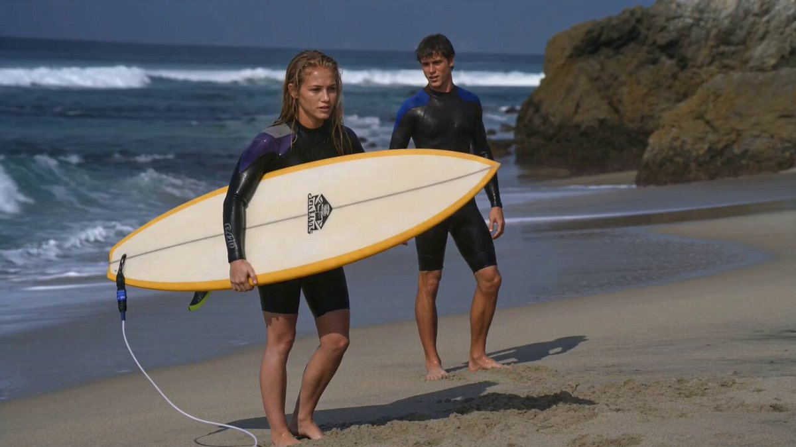
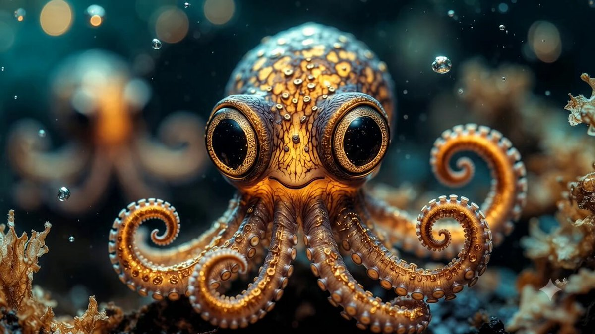

# Awesome Gemini Omni Prompts [](https://awesome.re)

<div align="center">

**Curated Gemini Omni prompt + video examples for AI video generation.**

[](#featured-video-prompts)
[](videos/)
[](https://yuanxingniao.github.io/gemini-omni-prompt-gallery/?utm_source=github&utm_medium=badge&utm_campaign=awesome-gemini-omni-prompts)
[](LICENSE)

[View the interactive gallery](https://yuanxingniao.github.io/gemini-omni-prompt-gallery/?utm_source=github&utm_medium=hero&utm_campaign=awesome-gemini-omni-prompts) · [Submit a prompt](../../issues/new?template=submit-prompt.yml) · [Browse all cases](cases/cinematic-storytelling.md)

</div>

## Contents

- [Why this repo](#why-this-repo)
- [Featured video prompts](#featured-video-prompts)
- [Categories](#categories)
- [Prompt cases](#prompt-cases)
- [Use Gemini Omni prompts](#use-gemini-omni-prompts)
- [Contribute](#contribute)
- [Storage layout](#storage-layout)

## Why this repo

Gemini Omni unlocks a new style of video prompt workflow: reference media, prompt text, and final motion output can be studied together. This repository collects reusable public examples so creators can learn how prompt wording maps to visible video results.

What you will find here:

- Prompt + output video pairs from public X posts
- Reference media labels when a case uses before/after or source material
- Categories for cinematic scenes, reference edits, ads, explainers, VFX, and creatures
- Local MP4 files for quick GitHub preview, with stable paths for future migration
- A companion visual gallery for browsing and filtering cases

## Featured video prompts

<table>
<tr>
<td width="33%" valign="top">
<a href="videos/case-004-output-01.mp4"></a><br>
<strong>Paradise Window Edit</strong><br>
<sub>Room view turns into beach</sub>
</td>
<td width="33%" valign="top">
<a href="videos/case-005-output-01.mp4"></a><br>
<strong>Glass Lion Morph</strong><br>
<sub>Sculpture melts into clockwork</sub>
</td>
<td width="33%" valign="top">
<a href="videos/case-020-output-01.mp4"></a><br>
<strong>Aeneid Teaser Trailer</strong><br>
<sub>Ancient epic in one prompt</sub>
</td>
</tr>
<tr>
<td width="33%" valign="top">
<a href="videos/case-016-output-01.mp4"></a><br>
<strong>Psychedelic POV Ride</strong><br>
<sub>Bike clip remixed every second</sub>
</td>
<td width="33%" valign="top">
<a href="videos/case-007-output-01.mp4"></a><br>
<strong>Surf Drama Adaptation</strong><br>
<sub>Storyboard becomes live action</sub>
</td>
<td width="33%" valign="top">
<a href="videos/case-001-output-01.mp4"></a><br>
<strong>Mechanical Baby Octopus</strong><br>
<sub>Macro fantasy creature animation</sub>
</td>
</tr>
</table>

## Categories

- [🎬 Cinematic & Storytelling](cases/cinematic-storytelling.md) — 5 cases
- [🎞️ Reference Video Editing](cases/reference-video-editing.md) — 3 cases
- [📣 Product & Advertising](cases/product-advertising.md) — 2 cases
- [🧠 Explainers & Education](cases/explainers-education.md) — 4 cases
- [🌀 Surreal Motion & VFX](cases/surreal-motion-vfx.md) — 5 cases
- [🧬 Characters & Creatures](cases/characters-creatures.md) — 3 cases

## Prompt cases

### 🎬 Cinematic & Storytelling

> 5 curated cases — [See all ->](cases/cinematic-storytelling.md)

<!-- case-003: Exploring Mars Trailer by @sajalrajhans1 -->
### Case 003: [Exploring Mars Trailer](https://x.com/sajalrajhans1/status/2056790440943419395) (by [@sajalrajhans1](https://x.com/sajalrajhans1))

> 10-second sci-fi teaser  
> Category: **Cinematic & Storytelling** · Source: [X post](https://x.com/sajalrajhans1/status/2056790440943419395) · Full gallery: [Gemini Omni Prompt Gallery](https://yuanxingniao.github.io/gemini-omni-prompt-gallery/)

| Output |
| :----: |
| <a href="./videos/case-003-output-01.mp4"></a> |

**Prompt:**

```text
Generate a 10-second cinematic teaser trailer for a movie titled “Exploring Mars.”
```

<!-- case-009: Realistic Music Video by @Ominousind -->
### Case 009: [Realistic Music Video](https://x.com/Ominousind/status/2056956627572420815) (by [@Ominousind](https://x.com/Ominousind))

> Jam session turned cinematic  
> Category: **Cinematic & Storytelling** · Source: [X post](https://x.com/Ominousind/status/2056956627572420815) · Full gallery: [Gemini Omni Prompt Gallery](https://yuanxingniao.github.io/gemini-omni-prompt-gallery/)

| Output |
| :----: |
| <a href="./videos/case-009-output-01.mp4"></a> |

**Reference media:** [case-009-reference-01.mp4](./videos/case-009-reference-01.mp4)

**Prompt:**

```text
Turn this into a really high quality music video while keeping the instruments and playing realistic.
```

<!-- case-015: Humanoid vs Dragon by @ca_shridhar -->
### Case 015: [Humanoid vs Dragon](https://x.com/ca_shridhar/status/2056994482957205585) (by [@ca_shridhar](https://x.com/ca_shridhar))

> Golden fighter fantasy battle  
> Category: **Cinematic & Storytelling** · Source: [X post](https://x.com/ca_shridhar/status/2056994482957205585) · Full gallery: [Gemini Omni Prompt Gallery](https://yuanxingniao.github.io/gemini-omni-prompt-gallery/)

| Output |
| :----: |
| <a href="./videos/case-015-output-01.mp4"></a> |

**Prompt:**

```text
A humanoid with white color and golden tint fighting a colourful dragon
```

### 🎞️ Reference Video Editing

> 3 curated cases — [See all ->](cases/reference-video-editing.md)

<!-- case-004: Paradise Window Edit by @DotCSV -->
### Case 004: [Paradise Window Edit](https://x.com/DotCSV/status/2056807804737130662) (by [@DotCSV](https://x.com/DotCSV))

> Room view turns into beach  
> Category: **Reference Video Editing** · Source: [X post](https://x.com/DotCSV/status/2056807804737130662) · Full gallery: [Gemini Omni Prompt Gallery](https://yuanxingniao.github.io/gemini-omni-prompt-gallery/)

| Output |
| :----: |
| <a href="./videos/case-004-output-01.mp4"></a><br><a href="./videos/case-004-output-02.mp4"></a> |

**Reference media:** [case-004-reference-01.mp4](./videos/case-004-reference-01.mp4)

**Prompt:**

```text
cambia las vistas de la ventana por una playa paradisíaca 👇
```

<!-- case-007: Surf Drama Adaptation by @BrentLynch -->
### Case 007: [Surf Drama Adaptation](https://x.com/BrentLynch/status/2056903725613252820) (by [@BrentLynch](https://x.com/BrentLynch))

> Storyboard becomes live action  
> Category: **Reference Video Editing** · Source: [X post](https://x.com/BrentLynch/status/2056903725613252820) · Full gallery: [Gemini Omni Prompt Gallery](https://yuanxingniao.github.io/gemini-omni-prompt-gallery/)

| Output |
| :----: |
| <a href="./videos/case-007-output-01.mp4"></a> |

**Reference media:** [reference-01.jpg](./images/case-007/reference-01.jpg)

**Prompt:**

```text
Adapt this into a high-end, slick live-action cinematic film scene following this production board, faithfully adapted from the provided production storyboard. Shot on location with an high end camera on 65mm film, capturing crisp, ultrafine film grain and dramatic cinematography.
```

<!-- case-016: Psychedelic POV Ride by @egeberkina -->
### Case 016: [Psychedelic POV Ride](https://x.com/egeberkina/status/2056842080777875605) (by [@egeberkina](https://x.com/egeberkina))

> Bike clip remixed every second  
> Category: **Reference Video Editing** · Source: [X post](https://x.com/egeberkina/status/2056842080777875605) · Full gallery: [Gemini Omni Prompt Gallery](https://yuanxingniao.github.io/gemini-omni-prompt-gallery/)

| Output |
| :----: |
| <a href="./videos/case-016-output-01.mp4"></a> |

**Prompt:**

```text
edo this POV biking video so that the entire environment changes every 1 second (24 frames at 24fps), rapid-fire transitions between insane psychedelic worlds, seamless first-person GoPro perspective maintained throughout, handlebars always visible, ultra fast movement, cinematic motion blur. Every second introduces a completely different surreal environment: neon rave tunnels, rainbow fractal highways, glowing mushroom forests, chrome liquid dimensions, cyberpunk dream cities, floating cloud roads, acid-trip deserts, underwater neon tunnels, kaleidoscope universes, hyperpop internet-core chaos. Extremely vibrant colors, dreamlike lighting, weirdcore aesthetic, immersive psychedelic energy, smooth but chaotic transitions, viral TikTok/Reels style pacing, ultra cinematic realism, overstimulating visuals, constant dopamine-hit imagery
```

### 📣 Product & Advertising

> 2 curated cases — [See all ->](cases/product-advertising.md)

<!-- case-018: Sauerkraut TikTok Ad by @Freeeman_Gordon -->
### Case 018: [Sauerkraut TikTok Ad](https://x.com/Freeeman_Gordon/status/2056773506365346231) (by [@Freeeman_Gordon](https://x.com/Freeeman_Gordon))

> One-line product commercial  
> Category: **Product & Advertising** · Source: [X post](https://x.com/Freeeman_Gordon/status/2056773506365346231) · Full gallery: [Gemini Omni Prompt Gallery](https://yuanxingniao.github.io/gemini-omni-prompt-gallery/)

| Output |
| :----: |
| <a href="./videos/case-018-output-01.mp4"></a> |

**Prompt:**

```text
A flashy ad for Sauerkraut, targetting young tiktok audience"
```

<!-- case-021: Spanish Salmorejo Test by @antonello -->
### Case 021: [Spanish Salmorejo Test](https://x.com/antonello/status/2056788279781896419) (by [@antonello](https://x.com/antonello))

> Food scene with rough diction  
> Category: **Product & Advertising** · Source: [X post](https://x.com/antonello/status/2056788279781896419) · Full gallery: [Gemini Omni Prompt Gallery](https://yuanxingniao.github.io/gemini-omni-prompt-gallery/)

| Output |
| :----: |
| <a href="./videos/case-021-output-01.mp4"></a> |

**Prompt:**

```text
con problemas en la dicción del español eso sí, el salmorejo le cuesta
```

### 🧠 Explainers & Education

> 4 curated cases — [See all ->](cases/explainers-education.md)

<!-- case-002: Butter Crust Ideas by @pigeon__s -->
### Case 002: [Butter Crust Ideas](https://x.com/pigeon__s/status/2056921117445521524) (by [@pigeon__s](https://x.com/pigeon__s))

> Recipe explainer from leftovers  
> Category: **Explainers & Education** · Source: [X post](https://x.com/pigeon__s/status/2056921117445521524) · Full gallery: [Gemini Omni Prompt Gallery](https://yuanxingniao.github.io/gemini-omni-prompt-gallery/)

| Output |
| :----: |
| <a href="./videos/case-002-output-01.mp4"></a> |

**Prompt:**

```text
generate a video of what i can do with leftover homemade butter pie crust besides making a pie obviously and include ingredients
```

<!-- case-006: V8 Engine Explainer by @yasinaktimur -->
### Case 006: [V8 Engine Explainer](https://x.com/yasinaktimur/status/2056826860508463448) (by [@yasinaktimur](https://x.com/yasinaktimur))

> Mechanics explained on video  
> Category: **Explainers & Education** · Source: [X post](https://x.com/yasinaktimur/status/2056826860508463448) · Full gallery: [Gemini Omni Prompt Gallery](https://yuanxingniao.github.io/gemini-omni-prompt-gallery/)

| Output |
| :----: |
| <a href="./videos/case-006-output-01.mp4"></a> |

**Prompt:**

```text
8 pistonlu motorların nasıl çalıştığını açıklayan adam.
```

<!-- case-010: Ryzen Comparison Video by @pigeon__s -->
### Case 010: [Ryzen Comparison Video](https://x.com/pigeon__s/status/2056854133672407206) (by [@pigeon__s](https://x.com/pigeon__s))

> CPU differences explained  
> Category: **Explainers & Education** · Source: [X post](https://x.com/pigeon__s/status/2056854133672407206) · Full gallery: [Gemini Omni Prompt Gallery](https://yuanxingniao.github.io/gemini-omni-prompt-gallery/)

| Output |
| :----: |
| <a href="./videos/case-010-output-01.mp4"></a> |

**Prompt:**

```text
research the difference between the Ryzen 9 9950X3D and the Ryzen 9 9950X3D2 Dual Edition and make a video showing the difference and explaining it
```

### 🌀 Surreal Motion & VFX

> 5 curated cases — [See all ->](cases/surreal-motion-vfx.md)

<!-- case-005: Glass Lion Morph by @raza8542121 -->
### Case 005: [Glass Lion Morph](https://x.com/raza8542121/status/2056807415421751372) (by [@raza8542121](https://x.com/raza8542121))

> Sculpture melts into clockwork  
> Category: **Surreal Motion & VFX** · Source: [X post](https://x.com/raza8542121/status/2056807415421751372) · Full gallery: [Gemini Omni Prompt Gallery](https://yuanxingniao.github.io/gemini-omni-prompt-gallery/)

| Output |
| :----: |
| <a href="./videos/case-005-output-01.mp4"></a> |

**Prompt:**

```text
A cinematic macro shot of a sleek, glass sculpture of a lion standing on a wooden table. The glass gradually melts into a flowing, golden liquid, which then reorganizes itself into a complex, intricate mechanical clockwork lion, all in one continuous, fluid 10-second motion.
```

<!-- case-008: Physics Evolution by @raza8542121 -->
### Case 008: [Physics Evolution](https://x.com/raza8542121/status/2056805328382316995) (by [@raza8542121](https://x.com/raza8542121))

> Solar system to neural network  
> Category: **Surreal Motion & VFX** · Source: [X post](https://x.com/raza8542121/status/2056805328382316995) · Full gallery: [Gemini Omni Prompt Gallery](https://yuanxingniao.github.io/gemini-omni-prompt-gallery/)

| Output |
| :----: |
| <a href="./videos/case-008-output-01.mp4"></a> |

**Prompt:**

```text
A cinematic 10-second sequence showcasing the evolution of a physical concept: start with a detailed 3D claymation model of a solar system, then seamlessly transform it into a fluid, hyper-realistic water simulation flowing into the shape of a neural network, demonstrating advanced multi-modal world modeling and physics-based fluid dynamics
```

<!-- case-011: Blueprint City Growth by @raza8542121 -->
### Case 011: [Blueprint City Growth](https://x.com/raza8542121/status/2056809379752460346) (by [@raza8542121](https://x.com/raza8542121))

> Sketch lines become skyscrapers  
> Category: **Surreal Motion & VFX** · Source: [X post](https://x.com/raza8542121/status/2056809379752460346) · Full gallery: [Gemini Omni Prompt Gallery](https://yuanxingniao.github.io/gemini-omni-prompt-gallery/)

| Output |
| :----: |
| <a href="./videos/case-011-output-01.mp4"></a> |

**Prompt:**

```text
A high-speed time-lapse showing the growth of a futuristic city. Initially, the buildings are sketched in simple white lines on a black blueprint. As the camera pans, the lines pulse with light and transform into hyper-realistic, photorealistic glass and steel skyscrapers, with holographic traffic flowing between them, reflecting the transition from an AI's abstract thought to reality
```

### 🧬 Characters & Creatures

> 3 curated cases — [See all ->](cases/characters-creatures.md)

<!-- case-001: Mechanical Baby Octopus by @andrewolinek -->
### Case 001: [Mechanical Baby Octopus](https://x.com/andrewolinek/status/2057003482012402018) (by [@andrewolinek](https://x.com/andrewolinek))

> Macro fantasy creature animation  
> Category: **Characters & Creatures** · Source: [X post](https://x.com/andrewolinek/status/2057003482012402018) · Full gallery: [Gemini Omni Prompt Gallery](https://yuanxingniao.github.io/gemini-omni-prompt-gallery/)

| Output |
| :----: |
| <a href="./videos/case-001-output-01.mp4"></a> |

**Prompt:**

```text
"image_profile": {     "source_style": "professional macro fantasy photography",     "overall_aesthetic": "hyper-photorealistic, ultra-detailed, whimsical and bioluminescent underwater style, National Geographic-level texture fidelity",     "mood": "mysterious, playful, and magical",     "subject": {       "main_subject": "mechanical baby octopus creature",       "description": "A small, wide-eyed marine entity blending organic flesh with ornate clockwork elements. It features large, glassy, luminous black eyes with starry glints and a small smiling mouth.",       "clothing_details": "not applicable",       "facial_features": "Oversized, expressive, highly reflective dark eyes bordered by intricate golden metallic rims, set into a bulbous, textured head covered in small rivets and filigree.",       "pose_and_action": "Centrally positioned, looking forward towards the camera with curling, gold-adorned tentacles spreading downward.",       "texture_details": "Polished brass and gold metallic components, translucent pearlescent skin, raised sensory bumps, and micro-engraved metallic gears seamlessly embedded into the skin."    },     "environment": {       "setting": "deep ocean or mystical aquatic biome",       "background_elements": "Another similar creature blurred in the background, surrounded by floating organic debris, bubbles, and soft sea flora.",       "atmosphere": "Deep underwater marine setting filled with suspended particles and floating light orbs, creating a dreamlike, subaquatic bokeh effect.",       "color_palette": "Deep teals and blues contrasted heavily with warm golden, amber, and orange bioluminescent glows."    },     "lighting": {       "primary_light": "Internal bioluminescent amber glow radiating from within the creature's head and tentacles",       "secondary_light": "Soft blue ambient underwater light highlighting the upper curves of the body",       "shadows": "Smooth, gentle drop shadows accentuating the depth of the tentacles and metallic details",       "mood_lighting": "Magical, high-contrast glow with dramatic golden rim lighting against a dark cool background"    },     "composition": {       "framing": "vertical close-up portrait",       "focal_point": "The sharp, highly reflective left eye and the intricate gold detailing on the head",       "depth": "Extremely shallow depth of field, creating a buttery, circular bokeh out of background lights",       "perspective": "Eye-level, intimate close-up perspective",       "negative_space": "Dark, desaturated teal and blue background framing the bright, warm subject"    },     "camera_and_technical": {       "camera": "Sony A7R V",       "lens": "90mm f/2.8 Macro lens",       "settings": "ISO 400, f/3.2, 1/160s",       "film_stock": "CineStill 800T emulation for dramatic tungsten and ambient glow",       "post_processing": "Enhanced micro-contrast, vibrant golden-hour color grading on the subject, crisp sharpness retention on metallic textures"    },     "quality_level": "museum-grade photorealism, maximum texture fidelity, zero AI artifacts, National Geographic / magazine cover quality, 8K resolution"  }
```

<!-- case-013: LED Robot Frog by @DylanBishopX -->
### Case 013: [LED Robot Frog](https://x.com/DylanBishopX/status/2056893369834746082) (by [@DylanBishopX](https://x.com/DylanBishopX))

> Mechanical creature wall crawl  
> Category: **Characters & Creatures** · Source: [X post](https://x.com/DylanBishopX/status/2056893369834746082) · Full gallery: [Gemini Omni Prompt Gallery](https://yuanxingniao.github.io/gemini-omni-prompt-gallery/)

| Output |
| :----: |
| <a href="./videos/case-013-output-01.mp4"></a> |

**Prompt:**

```text
A mechanical robot frog (poison, dart frog) with LED lights crawling on a white wall
```

<!-- case-019: Pelican on a Bike by @mlhobbyist -->
### Case 019: [Pelican on a Bike](https://x.com/mlhobbyist/status/2056936549884014724) (by [@mlhobbyist](https://x.com/mlhobbyist))

> Mandatory absurd video test  
> Category: **Characters & Creatures** · Source: [X post](https://x.com/mlhobbyist/status/2056936549884014724) · Full gallery: [Gemini Omni Prompt Gallery](https://yuanxingniao.github.io/gemini-omni-prompt-gallery/)

| Output |
| :----: |
| <a href="./videos/case-019-output-01.mp4"></a> |

**Prompt:**

```text
A pelican riding a bike
```

## Use Gemini Omni prompts

Each case includes:

- **Prompt** — the exact reusable instruction when available
- **Output video** — local MP4 preview stored in this repository
- **Reference media** — source/reference video or image when manually identified
- **Source** — original X post and creator credit

For a richer browsing experience, use the interactive gallery:

[Open Gemini Omni Prompt Gallery](https://yuanxingniao.github.io/gemini-omni-prompt-gallery/?utm_source=github&utm_medium=readme&utm_campaign=awesome-gemini-omni-prompts)

## Contribute

Have a high-quality Gemini Omni prompt with a visible video result? Open an issue with:

- Full prompt text
- Output video or source post link
- Reference media if any
- Original creator attribution
- Suggested category

## Storage layout

```text
videos/                  # local MP4 previews, ZeroLu-style for the first release
images/case-xxx/          # lightweight covers and reference thumbnails
data/prompts.json         # structured source of truth
cases/*.md                # category pages generated from data
```

This repo intentionally starts with local videos for simplicity. If the media set grows beyond a comfortable GitHub size, the same paths can be migrated to object storage such as GCS or R2 while keeping `data/prompts.json` stable.

## Acknowledgements

Thanks to the public creators on X who shared Gemini Omni experiments and prompts. Attribution is preserved on every case whenever available.

## Star history

[](https://www.star-history.com/#EchoSell/awesome-gemini-omni-prompts&Date)
