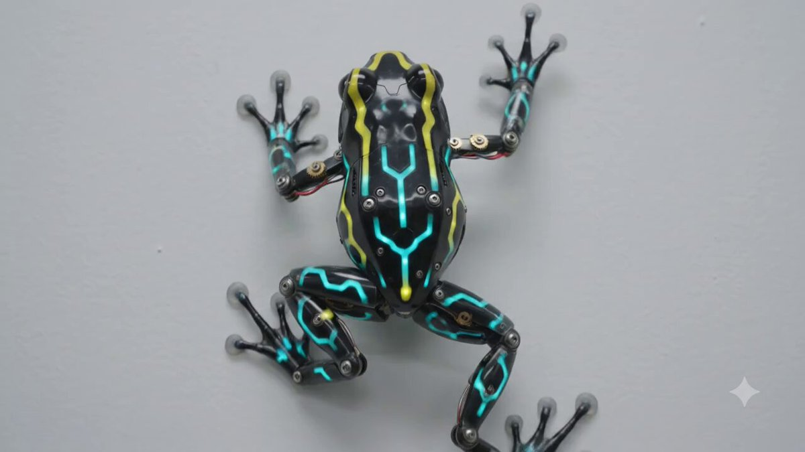
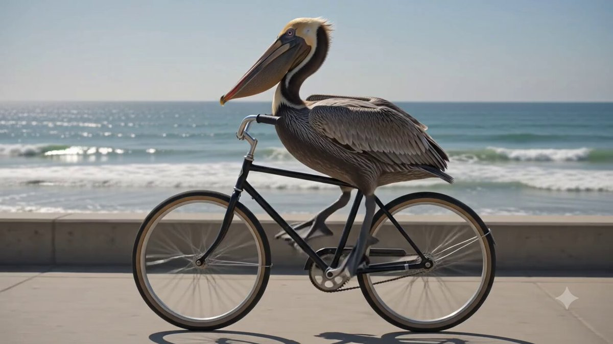

# 🧬 Characters & Creatures

> Creatures, animals, avatars, characters, and personality-driven video concepts.

Part of [Awesome Gemini Omni Prompts](../README.md).

<!-- case-001: Mechanical Baby Octopus by @andrewolinek -->
### Case 001: [Mechanical Baby Octopus](https://x.com/andrewolinek/status/2057003482012402018) (by [@andrewolinek](https://x.com/andrewolinek))

> Macro fantasy creature animation  
> Category: **Characters & Creatures** · Source: [X post](https://x.com/andrewolinek/status/2057003482012402018) · Full gallery: [Gemini Omni Prompt Gallery](https://yuanxingniao.github.io/gemini-omni-prompt-gallery/)

| Output |
| :----: |
| <a href="../videos/case-001-output-01.mp4"></a> |

**Prompt:**

```text
"image_profile": {     "source_style": "professional macro fantasy photography",     "overall_aesthetic": "hyper-photorealistic, ultra-detailed, whimsical and bioluminescent underwater style, National Geographic-level texture fidelity",     "mood": "mysterious, playful, and magical",     "subject": {       "main_subject": "mechanical baby octopus creature",       "description": "A small, wide-eyed marine entity blending organic flesh with ornate clockwork elements. It features large, glassy, luminous black eyes with starry glints and a small smiling mouth.",       "clothing_details": "not applicable",       "facial_features": "Oversized, expressive, highly reflective dark eyes bordered by intricate golden metallic rims, set into a bulbous, textured head covered in small rivets and filigree.",       "pose_and_action": "Centrally positioned, looking forward towards the camera with curling, gold-adorned tentacles spreading downward.",       "texture_details": "Polished brass and gold metallic components, translucent pearlescent skin, raised sensory bumps, and micro-engraved metallic gears seamlessly embedded into the skin."    },     "environment": {       "setting": "deep ocean or mystical aquatic biome",       "background_elements": "Another similar creature blurred in the background, surrounded by floating organic debris, bubbles, and soft sea flora.",       "atmosphere": "Deep underwater marine setting filled with suspended particles and floating light orbs, creating a dreamlike, subaquatic bokeh effect.",       "color_palette": "Deep teals and blues contrasted heavily with warm golden, amber, and orange bioluminescent glows."    },     "lighting": {       "primary_light": "Internal bioluminescent amber glow radiating from within the creature's head and tentacles",       "secondary_light": "Soft blue ambient underwater light highlighting the upper curves of the body",       "shadows": "Smooth, gentle drop shadows accentuating the depth of the tentacles and metallic details",       "mood_lighting": "Magical, high-contrast glow with dramatic golden rim lighting against a dark cool background"    },     "composition": {       "framing": "vertical close-up portrait",       "focal_point": "The sharp, highly reflective left eye and the intricate gold detailing on the head",       "depth": "Extremely shallow depth of field, creating a buttery, circular bokeh out of background lights",       "perspective": "Eye-level, intimate close-up perspective",       "negative_space": "Dark, desaturated teal and blue background framing the bright, warm subject"    },     "camera_and_technical": {       "camera": "Sony A7R V",       "lens": "90mm f/2.8 Macro lens",       "settings": "ISO 400, f/3.2, 1/160s",       "film_stock": "CineStill 800T emulation for dramatic tungsten and ambient glow",       "post_processing": "Enhanced micro-contrast, vibrant golden-hour color grading on the subject, crisp sharpness retention on metallic textures"    },     "quality_level": "museum-grade photorealism, maximum texture fidelity, zero AI artifacts, National Geographic / magazine cover quality, 8K resolution"  }
```

<!-- case-013: LED Robot Frog by @DylanBishopX -->
### Case 013: [LED Robot Frog](https://x.com/DylanBishopX/status/2056893369834746082) (by [@DylanBishopX](https://x.com/DylanBishopX))

> Mechanical creature wall crawl  
> Category: **Characters & Creatures** · Source: [X post](https://x.com/DylanBishopX/status/2056893369834746082) · Full gallery: [Gemini Omni Prompt Gallery](https://yuanxingniao.github.io/gemini-omni-prompt-gallery/)

| Output |
| :----: |
| <a href="../videos/case-013-output-01.mp4"></a> |

**Prompt:**

```text
A mechanical robot frog (poison, dart frog) with LED lights crawling on a white wall
```

<!-- case-019: Pelican on a Bike by @mlhobbyist -->
### Case 019: [Pelican on a Bike](https://x.com/mlhobbyist/status/2056936549884014724) (by [@mlhobbyist](https://x.com/mlhobbyist))

> Mandatory absurd video test  
> Category: **Characters & Creatures** · Source: [X post](https://x.com/mlhobbyist/status/2056936549884014724) · Full gallery: [Gemini Omni Prompt Gallery](https://yuanxingniao.github.io/gemini-omni-prompt-gallery/)

| Output |
| :----: |
| <a href="../videos/case-019-output-01.mp4"></a> |

**Prompt:**

```text
A pelican riding a bike
```
