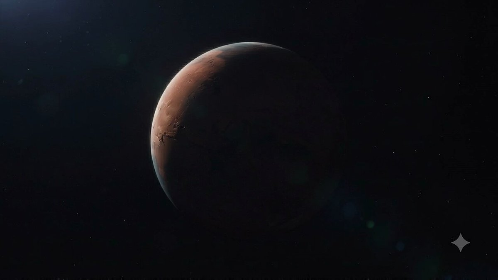
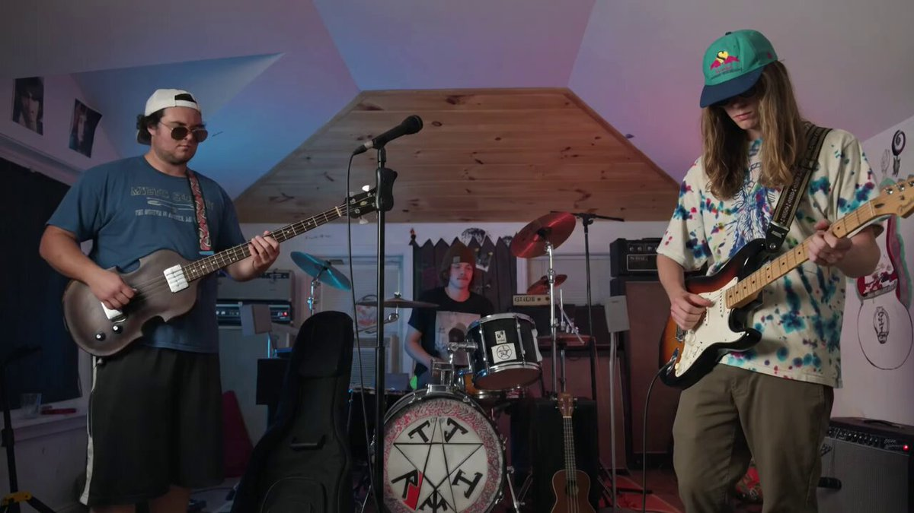
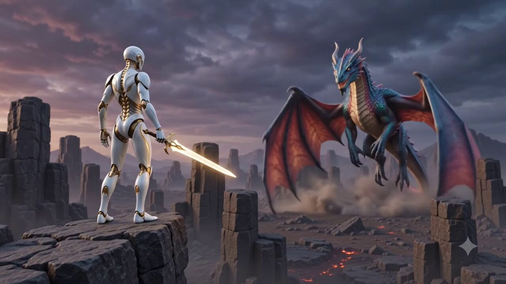
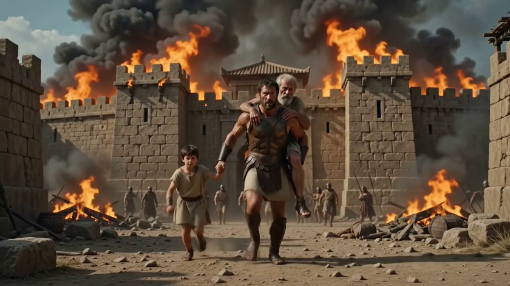
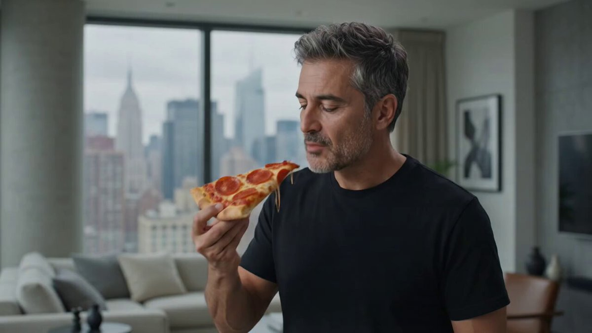

# 🎬 Cinematic & Storytelling

> Trailers, narrative scenes, epic worlds, and film-language prompts.

Part of [Awesome Gemini Omni Prompts](../README.md).

<!-- case-003: Exploring Mars Trailer by @sajalrajhans1 -->
### Case 003: [Exploring Mars Trailer](https://x.com/sajalrajhans1/status/2056790440943419395) (by [@sajalrajhans1](https://x.com/sajalrajhans1))

> 10-second sci-fi teaser  
> Category: **Cinematic & Storytelling** · Source: [X post](https://x.com/sajalrajhans1/status/2056790440943419395) · Full gallery: [Gemini Omni Prompt Gallery](https://yuanxingniao.github.io/gemini-omni-prompt-gallery/)

| Output |
| :----: |
| <a href="../videos/case-003-output-01.mp4"></a> |

**Prompt:**

```text
Generate a 10-second cinematic teaser trailer for a movie titled “Exploring Mars.”
```

<!-- case-009: Realistic Music Video by @Ominousind -->
### Case 009: [Realistic Music Video](https://x.com/Ominousind/status/2056956627572420815) (by [@Ominousind](https://x.com/Ominousind))

> Jam session turned cinematic  
> Category: **Cinematic & Storytelling** · Source: [X post](https://x.com/Ominousind/status/2056956627572420815) · Full gallery: [Gemini Omni Prompt Gallery](https://yuanxingniao.github.io/gemini-omni-prompt-gallery/)

| Output |
| :----: |
| <a href="../videos/case-009-output-01.mp4"></a> |

**Reference media:** [case-009-reference-01.mp4](../videos/case-009-reference-01.mp4)

**Prompt:**

```text
Turn this into a really high quality music video while keeping the instruments and playing realistic.
```

<!-- case-015: Humanoid vs Dragon by @ca_shridhar -->
### Case 015: [Humanoid vs Dragon](https://x.com/ca_shridhar/status/2056994482957205585) (by [@ca_shridhar](https://x.com/ca_shridhar))

> Golden fighter fantasy battle  
> Category: **Cinematic & Storytelling** · Source: [X post](https://x.com/ca_shridhar/status/2056994482957205585) · Full gallery: [Gemini Omni Prompt Gallery](https://yuanxingniao.github.io/gemini-omni-prompt-gallery/)

| Output |
| :----: |
| <a href="../videos/case-015-output-01.mp4"></a> |

**Prompt:**

```text
A humanoid with white color and golden tint fighting a colourful dragon
```

<!-- case-020: Aeneid Teaser Trailer by @emollick -->
### Case 020: [Aeneid Teaser Trailer](https://x.com/emollick/status/2056855332127711387) (by [@emollick](https://x.com/emollick))

> Ancient epic in one prompt  
> Category: **Cinematic & Storytelling** · Source: [X post](https://x.com/emollick/status/2056855332127711387) · Full gallery: [Gemini Omni Prompt Gallery](https://yuanxingniao.github.io/gemini-omni-prompt-gallery/)

| Output |
| :----: |
| <a href="../videos/case-020-output-01.mp4"></a> |

**Prompt:**

```text
The Odyssey and the Iliad get so many movie treatments but the sequel, the Roman Aeneid, is entirely ignored
```

<!-- case-022: Pizza Time Portal by @philsoutside -->
### Case 022: [Pizza Time Portal](https://x.com/philsoutside/status/2056883162622599274) (by [@philsoutside](https://x.com/philsoutside))

> NY slice opens Ancient Rome  
> Category: **Cinematic & Storytelling** · Source: [X post](https://x.com/philsoutside/status/2056883162622599274) · Full gallery: [Gemini Omni Prompt Gallery](https://yuanxingniao.github.io/gemini-omni-prompt-gallery/)

| Output |
| :----: |
| <a href="../videos/case-022-output-01.mp4"></a> |

**Prompt:**

```text
NY man teleports to Ancient Rome after biting into pizza
```
