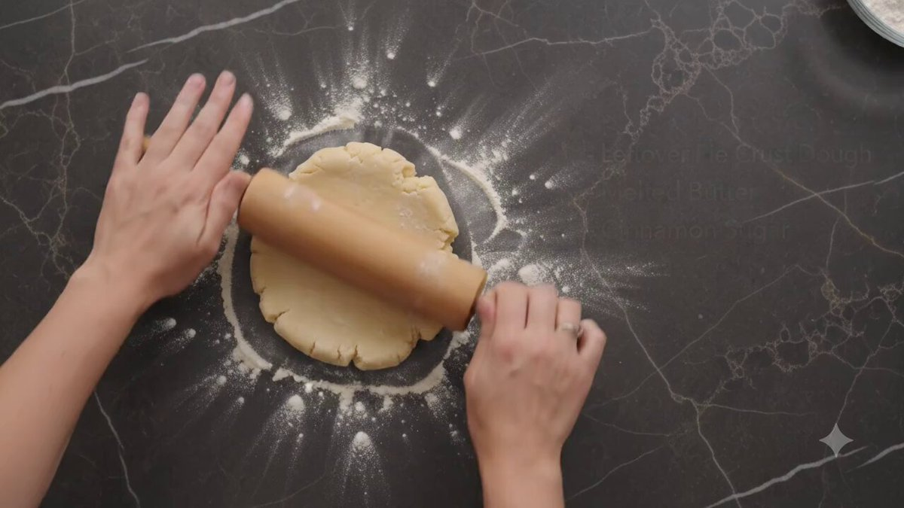
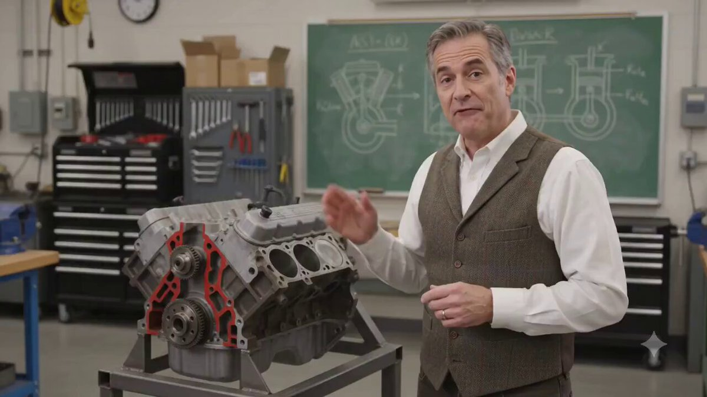
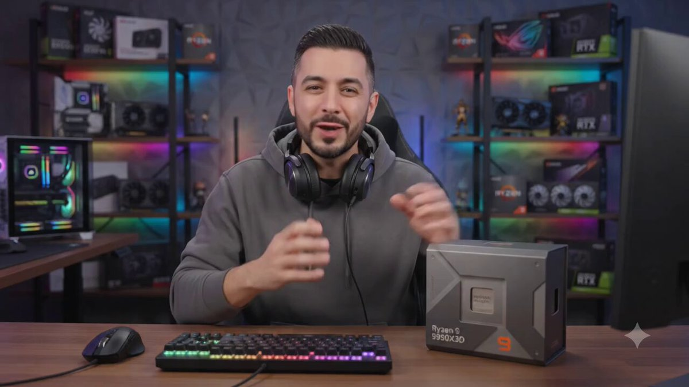
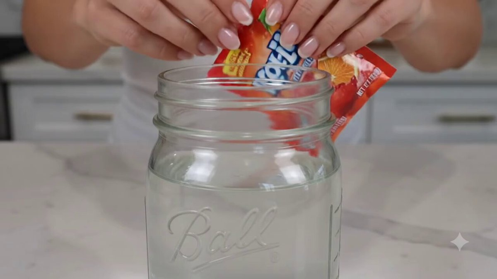

# 🧠 Explainers & Education

> Instructional videos, cooking ideas, technical explainers, and knowledge clips.

Part of [Awesome Gemini Omni Prompts](../README.md).

<!-- case-002: Butter Crust Ideas by @pigeon__s -->
### Case 002: [Butter Crust Ideas](https://x.com/pigeon__s/status/2056921117445521524) (by [@pigeon__s](https://x.com/pigeon__s))

> Recipe explainer from leftovers  
> Category: **Explainers & Education** · Source: [X post](https://x.com/pigeon__s/status/2056921117445521524) · Full gallery: [Gemini Omni Prompt Gallery](https://yuanxingniao.github.io/gemini-omni-prompt-gallery/)

| Output |
| :----: |
| <a href="../videos/case-002-output-01.mp4"></a> |

**Prompt:**

```text
generate a video of what i can do with leftover homemade butter pie crust besides making a pie obviously and include ingredients
```

<!-- case-006: V8 Engine Explainer by @yasinaktimur -->
### Case 006: [V8 Engine Explainer](https://x.com/yasinaktimur/status/2056826860508463448) (by [@yasinaktimur](https://x.com/yasinaktimur))

> Mechanics explained on video  
> Category: **Explainers & Education** · Source: [X post](https://x.com/yasinaktimur/status/2056826860508463448) · Full gallery: [Gemini Omni Prompt Gallery](https://yuanxingniao.github.io/gemini-omni-prompt-gallery/)

| Output |
| :----: |
| <a href="../videos/case-006-output-01.mp4"></a> |

**Prompt:**

```text
8 pistonlu motorların nasıl çalıştığını açıklayan adam.
```

<!-- case-010: Ryzen Comparison Video by @pigeon__s -->
### Case 010: [Ryzen Comparison Video](https://x.com/pigeon__s/status/2056854133672407206) (by [@pigeon__s](https://x.com/pigeon__s))

> CPU differences explained  
> Category: **Explainers & Education** · Source: [X post](https://x.com/pigeon__s/status/2056854133672407206) · Full gallery: [Gemini Omni Prompt Gallery](https://yuanxingniao.github.io/gemini-omni-prompt-gallery/)

| Output |
| :----: |
| <a href="../videos/case-010-output-01.mp4"></a> |

**Prompt:**

```text
research the difference between the Ryzen 9 9950X3D and the Ryzen 9 9950X3D2 Dual Edition and make a video showing the difference and explaining it
```

<!-- case-012: Powder Juice Dissolve by @goutoberry -->
### Case 012: [Powder Juice Dissolve](https://x.com/goutoberry/status/2056813586614247925) (by [@goutoberry](https://x.com/goutoberry))

> Kool-aid macro test  
> Category: **Explainers & Education** · Source: [X post](https://x.com/goutoberry/status/2056813586614247925) · Full gallery: [Gemini Omni Prompt Gallery](https://yuanxingniao.github.io/gemini-omni-prompt-gallery/)

| Output |
| :----: |
| <a href="../videos/case-012-output-01.mp4"></a> |

**Prompt:**

```text
Prompt: "A packet of powder juice like Kool-aid being poured and dissolving in a jar with water."
```
