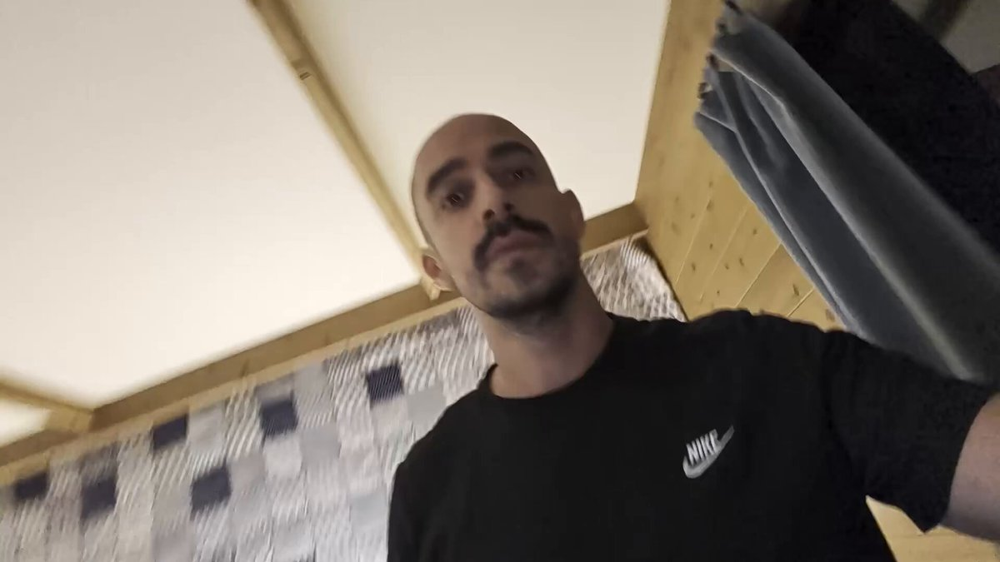
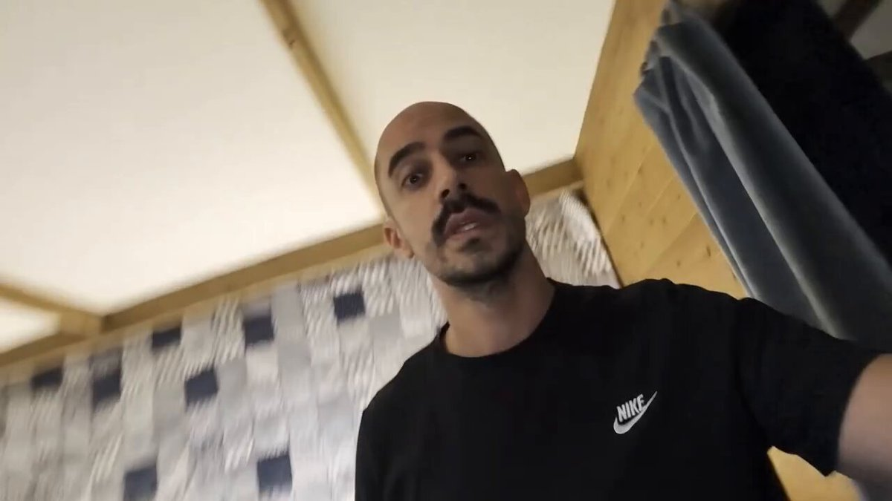
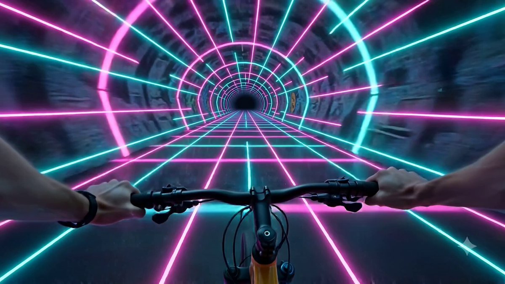

# 🎞️ Reference Video Editing

> Reference-driven edits, transformations, restaging, and before/after motion tests.

Part of [Awesome Gemini Omni Prompts](../README.md).

<!-- case-004: Paradise Window Edit by @DotCSV -->
### Case 004: [Paradise Window Edit](https://x.com/DotCSV/status/2056807804737130662) (by [@DotCSV](https://x.com/DotCSV))

> Room view turns into beach  
> Category: **Reference Video Editing** · Source: [X post](https://x.com/DotCSV/status/2056807804737130662) · Full gallery: [Gemini Omni Prompt Gallery](https://yuanxingniao.github.io/gemini-omni-prompt-gallery/)

| Output |
| :----: |
| <a href="../videos/case-004-output-01.mp4"></a><br><a href="../videos/case-004-output-02.mp4"></a> |

**Reference media:** [case-004-reference-01.mp4](../videos/case-004-reference-01.mp4)

**Prompt:**

```text
cambia las vistas de la ventana por una playa paradisíaca 👇
```

<!-- case-007: Surf Drama Adaptation by @BrentLynch -->
### Case 007: [Surf Drama Adaptation](https://x.com/BrentLynch/status/2056903725613252820) (by [@BrentLynch](https://x.com/BrentLynch))

> Storyboard becomes live action  
> Category: **Reference Video Editing** · Source: [X post](https://x.com/BrentLynch/status/2056903725613252820) · Full gallery: [Gemini Omni Prompt Gallery](https://yuanxingniao.github.io/gemini-omni-prompt-gallery/)

| Output |
| :----: |
| <a href="../videos/case-007-output-01.mp4"></a> |

**Reference media:** [reference-01.jpg](../images/case-007/reference-01.jpg)

**Prompt:**

```text
Adapt this into a high-end, slick live-action cinematic film scene following this production board, faithfully adapted from the provided production storyboard. Shot on location with an high end camera on 65mm film, capturing crisp, ultrafine film grain and dramatic cinematography.
```

<!-- case-016: Psychedelic POV Ride by @egeberkina -->
### Case 016: [Psychedelic POV Ride](https://x.com/egeberkina/status/2056842080777875605) (by [@egeberkina](https://x.com/egeberkina))

> Bike clip remixed every second  
> Category: **Reference Video Editing** · Source: [X post](https://x.com/egeberkina/status/2056842080777875605) · Full gallery: [Gemini Omni Prompt Gallery](https://yuanxingniao.github.io/gemini-omni-prompt-gallery/)

| Output |
| :----: |
| <a href="../videos/case-016-output-01.mp4"></a> |

**Prompt:**

```text
edo this POV biking video so that the entire environment changes every 1 second (24 frames at 24fps), rapid-fire transitions between insane psychedelic worlds, seamless first-person GoPro perspective maintained throughout, handlebars always visible, ultra fast movement, cinematic motion blur. Every second introduces a completely different surreal environment: neon rave tunnels, rainbow fractal highways, glowing mushroom forests, chrome liquid dimensions, cyberpunk dream cities, floating cloud roads, acid-trip deserts, underwater neon tunnels, kaleidoscope universes, hyperpop internet-core chaos. Extremely vibrant colors, dreamlike lighting, weirdcore aesthetic, immersive psychedelic energy, smooth but chaotic transitions, viral TikTok/Reels style pacing, ultra cinematic realism, overstimulating visuals, constant dopamine-hit imagery
```
