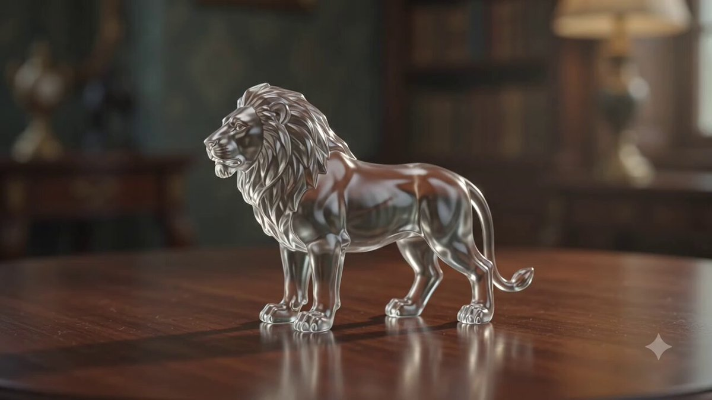
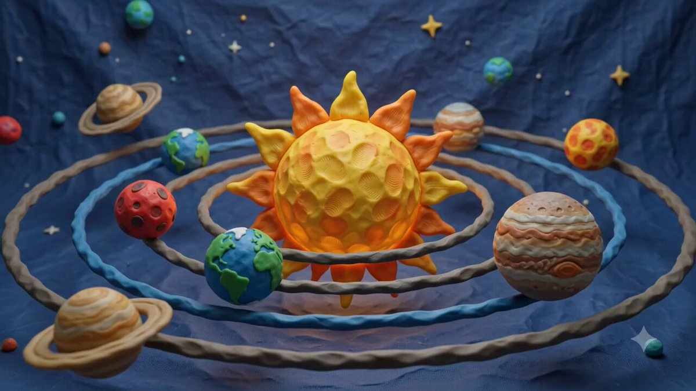
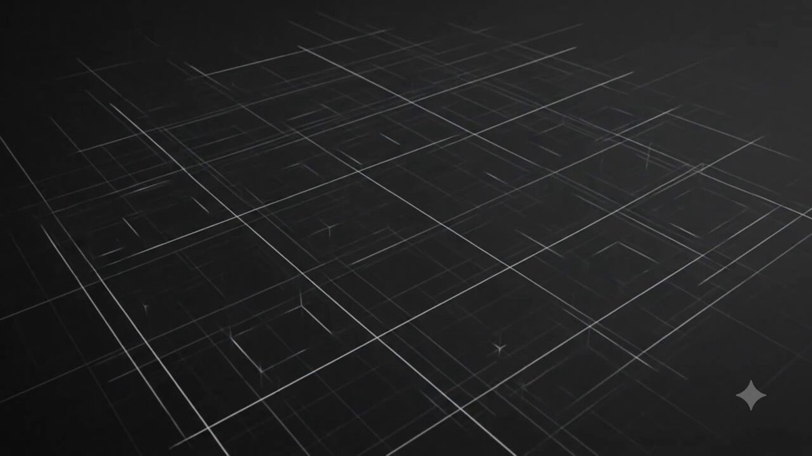
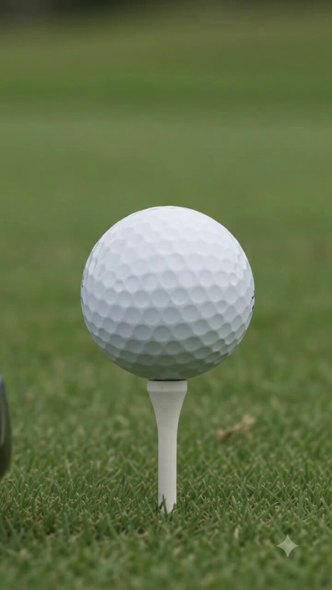
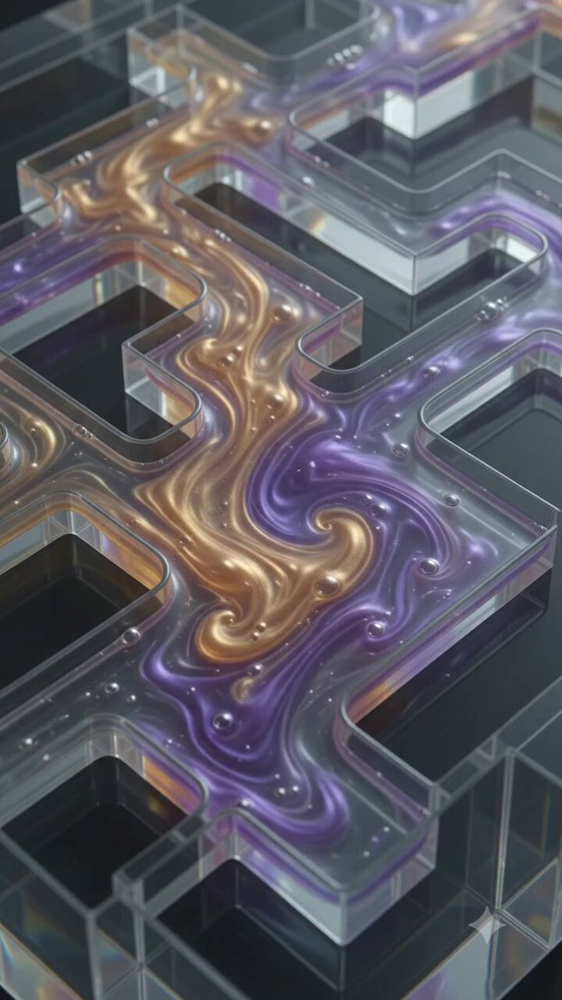

# 🌀 Surreal Motion & VFX

> Morphing, liquid motion, impossible physics, simulation, and visual effects.

Part of [Awesome Gemini Omni Prompts](../README.md).

<!-- case-005: Glass Lion Morph by @raza8542121 -->
### Case 005: [Glass Lion Morph](https://x.com/raza8542121/status/2056807415421751372) (by [@raza8542121](https://x.com/raza8542121))

> Sculpture melts into clockwork  
> Category: **Surreal Motion & VFX** · Source: [X post](https://x.com/raza8542121/status/2056807415421751372) · Full gallery: [Gemini Omni Prompt Gallery](https://yuanxingniao.github.io/gemini-omni-prompt-gallery/)

| Output |
| :----: |
| <a href="../videos/case-005-output-01.mp4"></a> |

**Prompt:**

```text
A cinematic macro shot of a sleek, glass sculpture of a lion standing on a wooden table. The glass gradually melts into a flowing, golden liquid, which then reorganizes itself into a complex, intricate mechanical clockwork lion, all in one continuous, fluid 10-second motion.
```

<!-- case-008: Physics Evolution by @raza8542121 -->
### Case 008: [Physics Evolution](https://x.com/raza8542121/status/2056805328382316995) (by [@raza8542121](https://x.com/raza8542121))

> Solar system to neural network  
> Category: **Surreal Motion & VFX** · Source: [X post](https://x.com/raza8542121/status/2056805328382316995) · Full gallery: [Gemini Omni Prompt Gallery](https://yuanxingniao.github.io/gemini-omni-prompt-gallery/)

| Output |
| :----: |
| <a href="../videos/case-008-output-01.mp4"></a> |

**Prompt:**

```text
A cinematic 10-second sequence showcasing the evolution of a physical concept: start with a detailed 3D claymation model of a solar system, then seamlessly transform it into a fluid, hyper-realistic water simulation flowing into the shape of a neural network, demonstrating advanced multi-modal world modeling and physics-based fluid dynamics
```

<!-- case-011: Blueprint City Growth by @raza8542121 -->
### Case 011: [Blueprint City Growth](https://x.com/raza8542121/status/2056809379752460346) (by [@raza8542121](https://x.com/raza8542121))

> Sketch lines become skyscrapers  
> Category: **Surreal Motion & VFX** · Source: [X post](https://x.com/raza8542121/status/2056809379752460346) · Full gallery: [Gemini Omni Prompt Gallery](https://yuanxingniao.github.io/gemini-omni-prompt-gallery/)

| Output |
| :----: |
| <a href="../videos/case-011-output-01.mp4"></a> |

**Prompt:**

```text
A high-speed time-lapse showing the growth of a futuristic city. Initially, the buildings are sketched in simple white lines on a black blueprint. As the camera pans, the lines pulse with light and transform into hyper-realistic, photorealistic glass and steel skyscrapers, with holographic traffic flowing between them, reflecting the transition from an AI's abstract thought to reality
```

<!-- case-014: Golf Ball Cliffhanger by @valentinflrz -->
### Case 014: [Golf Ball Cliffhanger](https://x.com/valentinflrz/status/2056852313151561810) (by [@valentinflrz](https://x.com/valentinflrz))

> Tension before the drop  
> Category: **Surreal Motion & VFX** · Source: [X post](https://x.com/valentinflrz/status/2056852313151561810) · Full gallery: [Gemini Omni Prompt Gallery](https://yuanxingniao.github.io/gemini-omni-prompt-gallery/)

| Output |
| :----: |
| <a href="../videos/case-014-output-01.mp4"></a> |

**Prompt:**

```text
Ultra-realistic, cliffhanger scene of a golf ball traveling and hanging in limbo between the hole and the edge. Pure tension, cinematic, and incredible. Close-up camera movement follows the ball flying through the air. Just as it is about to drop in, the scene cuts away.
```

<!-- case-017: Iridescent Liquid Loop by @marcyu03 -->
### Case 017: [Iridescent Liquid Loop](https://x.com/marcyu03/status/2056908569816256957) (by [@marcyu03](https://x.com/marcyu03))

> Crystal sculpture fluid motion  
> Category: **Surreal Motion & VFX** · Source: [X post](https://x.com/marcyu03/status/2056908569816256957) · Full gallery: [Gemini Omni Prompt Gallery](https://yuanxingniao.github.io/gemini-omni-prompt-gallery/)

| Output |
| :----: |
| <a href="../videos/case-017-output-01.mp4"></a> |

**Prompt:**

```text
A mesmerizing, seamless infinite loop of glowing iridescent liquid flowing through an intricate, labyrinth-like crystal sculpture. The liquid exhibits realistic fluid dynamics, swirling with pearlescent textures and shifting between ethereal gold and deep violet. Shot with a macro lens to capture ultra-realistic light refraction and "Subsurface Scattering" within the liquid. The environment is a minimalist dark studio with cinematic rim lighting that highlights every bubble and ripple. 4K, 60FPS, highly detailed, "Oddly Satisfying" aesthetic. No cuts, no flickering, perfectly synchronized beginning and end. Aspect ratio 9:16 for mobile-optimized social media viewing.
```
